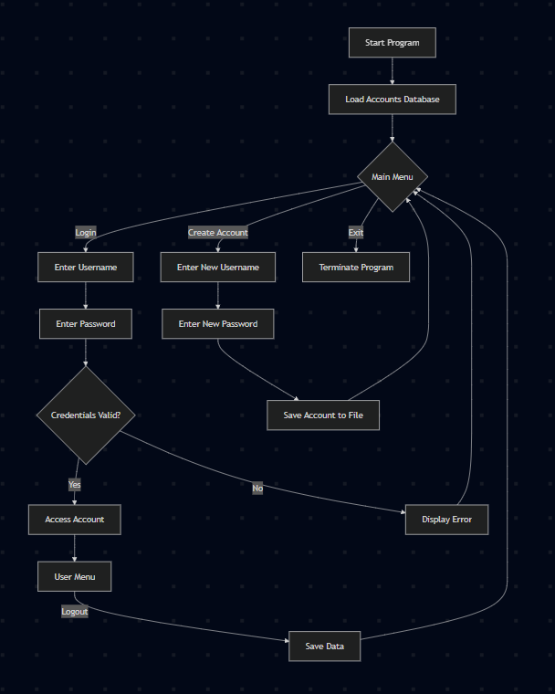
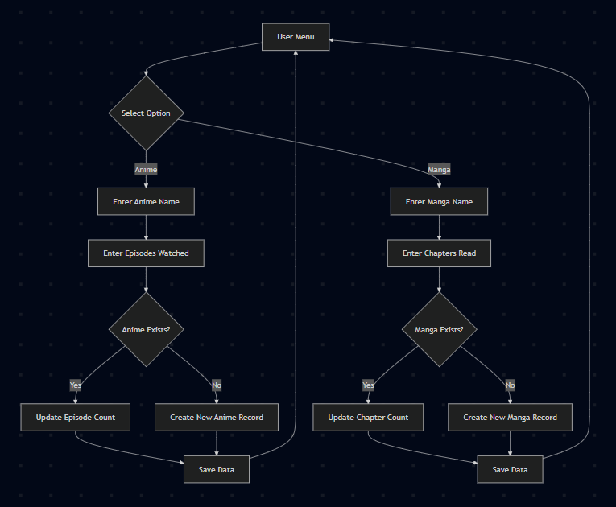
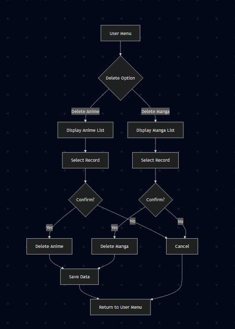

# 🎌 ARM - Anime Record Management

A C++ console-based Anime & Manga tracking system that allows users to manage their viewing and reading progress through a secure account system with persistent file storage.

---
# Version Control Naming Format
[NAME] v[Month]-[Version Date]-[Time]

- NAME                  [File Name]
- Month                 [Numerical (06) --> June ]
- Version Date          [Alphabetical Hierarchy]
- Time                  [PM / AM] 

## ✨ Features

### 👤 Account Management
- Create new user accounts
- Login authentication using username and PIN
- Multi-user support with separate records per account
- Account validation before dashboard access

### 💾 Data Persistence
- Automatic save and load functionality
- File-based database storage
- Data reconstruction on program startup
- Persistent user records between sessions

### 🎥 Anime Tracking
- Add anime titles and watched episodes
- Update existing anime progress automatically
- Prevent duplicate anime entries
- Store multiple anime records per account

### 📖 Manga Tracking
- Add manga titles and chapters read
- Update existing manga progress automatically
- Prevent duplicate manga entries
- Support decimal chapter values

### 📊 Dashboard & Analytics
- Display all anime records
- Display all manga records
- Calculate total episodes watched
- Calculate total chapters read
- Show average viewing and reading statistics

### 🗑️ Record Management
- Delete anime records
- Delete manga records
- Confirmation prompts before deletion

### 🛡️ Input Validation
- Handles invalid numeric inputs
- Prevents common user input errors
- Error messaging and recovery mechanisms

### 🎨 User Experience
- Color-coded terminal interface
- Loading animations
- Welcome screen
- Exit animation
- Organized menu navigation

---

## 🛠️ Technologies Used

- C++
- STL Vectors
- File Handling (`ifstream`, `ofstream`)
- Structures (`struct`)
- Threading (`<thread>`)
- Console UI Design

---

## 📂 Core Concepts Demonstrated

- Authentication System
- File Management
- Data Serialization
- Dynamic Data Structures
- CRUD Operations
- Modular Programming
- Persistent Storage
- Console Application Development

---

## 🚀 Future Improvements

- Password encryption
- Search functionality
- Episode/chapter editing
- User profile customization
- Watch time analytics
- Export records to CSV/Excel
- GUI version

## Target ARM Final
# Account Management FlowChart


# [Main] Anime Manga Record Management


# Deletion Flow


##

## Function Communication Flow

```text
Start Program
      │
      ▼
Load Database
      │
      ▼
Main Menu
 ├── Login
 ├── Create Account
 └── Exit
      │
      ▼
User Dashboard
 ├── Add Anime
 ├── Add Manga
 ├── Search Records
 ├── View Dashboard
 ├── Delete Anime
 ├── Delete Manga
 ├── Help
 └── Logout
      │
      ▼
Save Data
      │
      ▼
End Program
```

### Description

This diagram presents the overall flow of the Anime Record Manager (ARM) system. The program begins by loading previously saved account and record data from the database file before displaying the main menu. Users may create a new account, log in to an existing account, or exit the application. After successful authentication, the user gains access to the dashboard where core features such as adding anime or manga records, searching records, viewing statistics, deleting entries, and accessing help are available. Any modifications made during a session are saved to the database to ensure data persistence before the user logs out or exits the program. This flow illustrates the major stages of system execution and the navigation path available to users.
